---
title: 'GitHub pages Portfolio setup'
format:
  revealjs:
    menu: false
    buttons: false
    auto-stretch: false
    css: style.css
---

## Before we start

- GitHub account
- R + RStudio installed

## Plan for today

- Create a repo from a __template__
- Configure __automatic deployment__
- Make your first edit to __trigger a build__
- Copy locally 
- Push local changes to trigger another build

## Create repo {.section-intro}

{width=45% fig-align='center'}

## Copy the template

Find the Template repo for creating skills/experience portfolio at:

<https://github.com/TeachHealthData/workshop-portfolio-template>

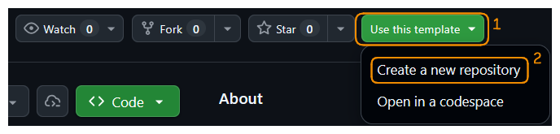

Find and click the green "Use this template" button

## Name your repo 

- The name you choose will be your final website URL  

:::{.highlight-tip}
[your-username.github.io/[repo-name]{style='color: green; font-weight: bold;'}]{style='font-family: monospace;'}
:::

- So choose something appropriately professional

:::{.r-stack}
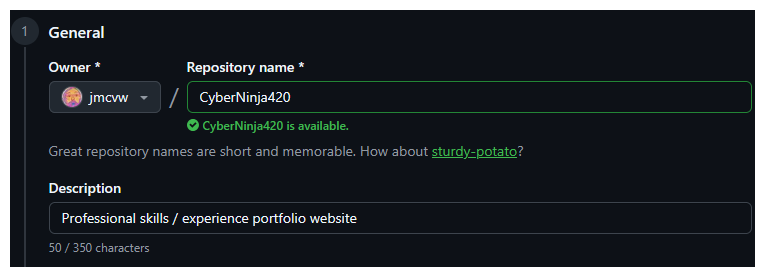{.fragment}

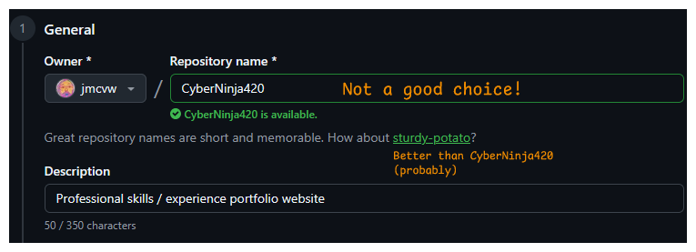{.fragment}
:::

## Make it public

- Don't hide your skills!

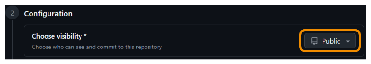

## Don't delegate this to AI

:::{.highlight-tip}
May break stuff!
:::

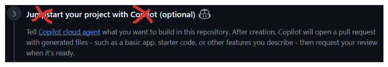

Copilot may add extra files that interfere with the automated build process

## Now we create the repo

- Big green button

:::{.fragment .highlight-success}
You now have your own website repository 👏
:::

## What's in the template?

- `.qmd` files — your pages, written in Markdown
- `_quarto.yml` — site configuration
- `.github/workflows/` — the Actions workflow that builds and publishes your site

:::{.highlight-tip}
GitHub Actions will handle everything automatically on every push
:::

## Prepare for deployment {.section-intro}

## Change `Pages` settings {.scrollable}

Find the `Settings` tab in the main nav bar

:::{.r-stack}
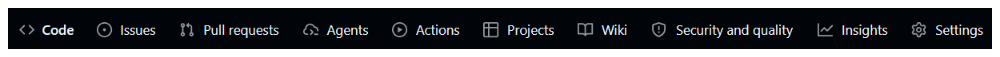{.fragment}

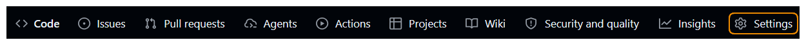{.fragment}
:::

:::{.columns .fragment}
:::{.column}
Now scan down the sidebar till you see `Pages`
:::

:::{.column}
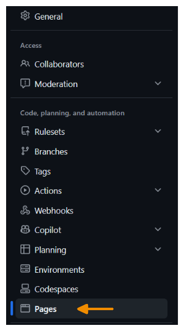
:::
:::

## Deploy with GitHub Actions

After completing this step, your website deployment will be configured

:::{.columns}
:::{.column .fragment width='40%'}

- This is the default

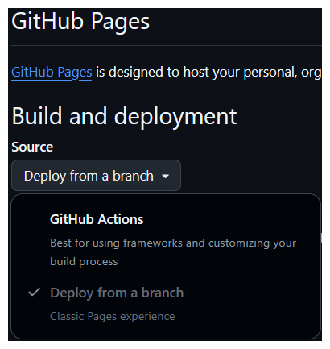
:::

:::{.fragment}

:::{.column width='40%'}

- Automated build

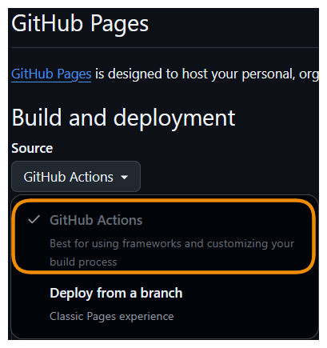
:::
:::
:::

## Make changes {.section-intro}

## Where's our website...?

In order to __trigger__ the `Build Actions` we have to make a change to our content

Let's update our `About` page

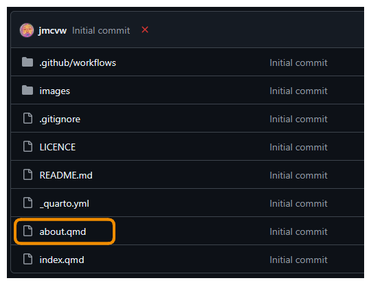

## Edit and commit

:::{.r-stack}
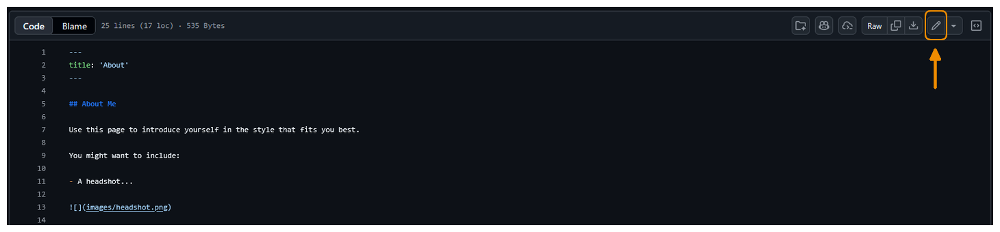{.fragment}

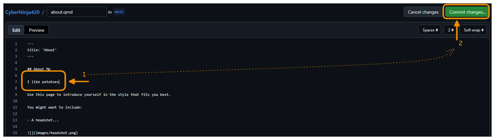{.fragment}

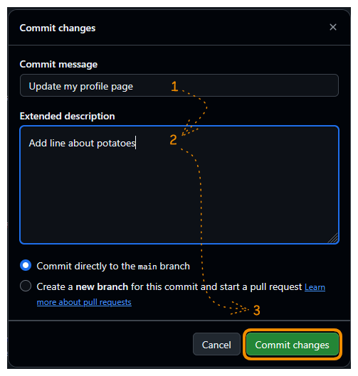{.fragment}
:::

:::{.fragment .highlight-success}
Commit -> Automatic build process triggered 🙌
:::

## GitHub Magic {.section-intro}

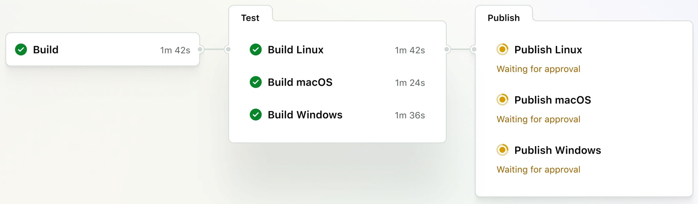{width='80%' fig-align=center}

## To see the magic

Return to `main` page

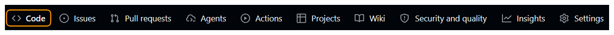

:::{.columns .fragment}
:::{.column}
And notice the wee yellow dot
:::

:::{.column}
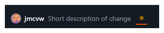
:::
:::

:::{.columns .fragment}
:::{.column}
You can click it...
:::

:::{.column}
:::{.r-stack}
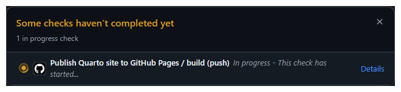

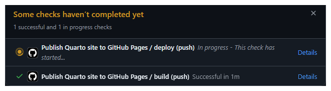{.fragment}

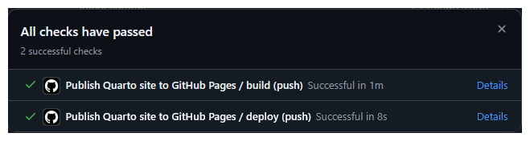{.fragment}
:::
:::
:::

:::{.fragment .highlight-success}
You now have a website!! 🎉
:::

## Find your URL

- Once the Action is complete you will have a website
- But where is it?

:::{.columns}
:::{.column .fragment}
Right hand side

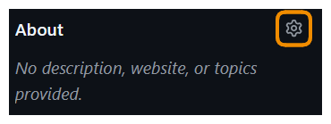
:::

:::{.column .fragment}
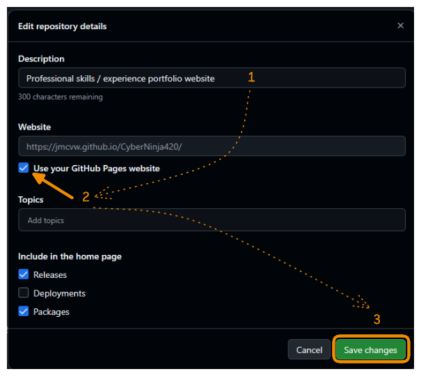
:::
:::

:::{.fragment .highlight-tip}
Bookmark this — it's your portfolio URL to share
:::

## New project {.section-intro}

:::{div}
{width=80% fig-align="center"}
:::

## Create with Git enabled

- We can create a new project directly from a Git repo

:::{.columns}
:::{.column .fragment}

- Choose __Create Project__ from __Version Control__

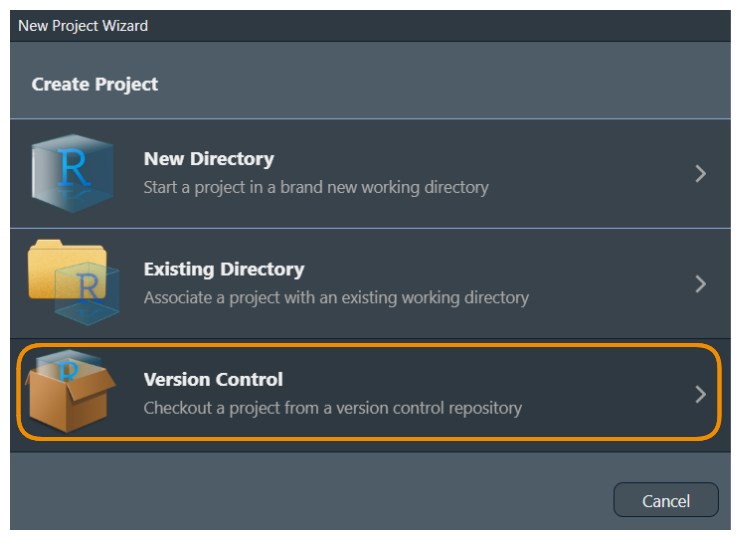
:::

:::{.column .fragment}

- Select the Git option
 
 

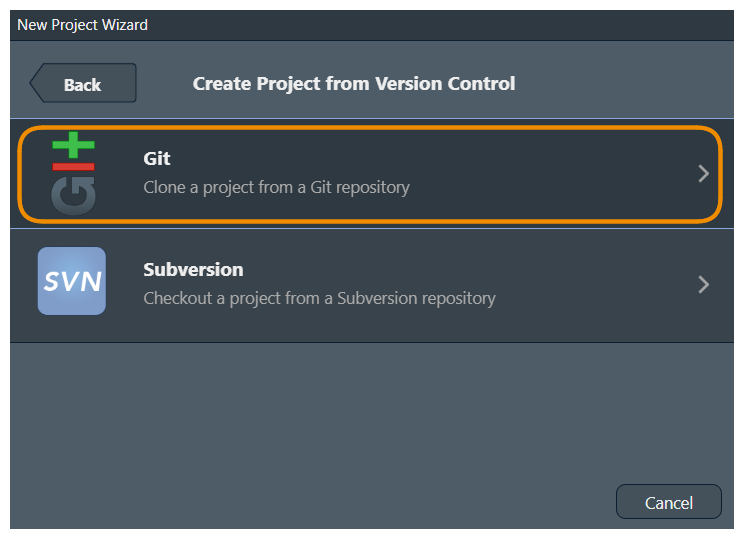
:::
:::

## Add `clone` url

Copy your repo's URL form your browser address bar

:::{.r-stack}
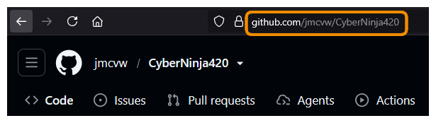

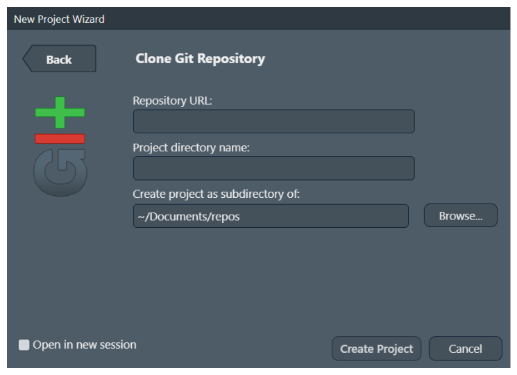{.fragment}

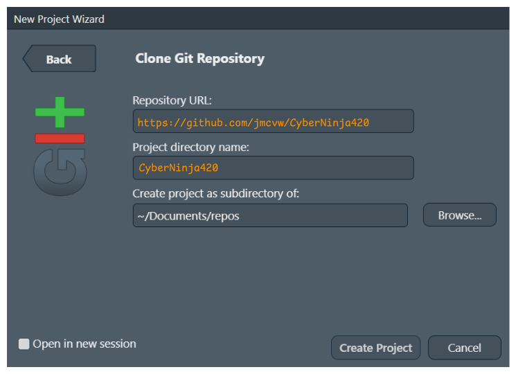{.fragment}
:::

## Make changes locally {.section-intro}

## Edit your About page

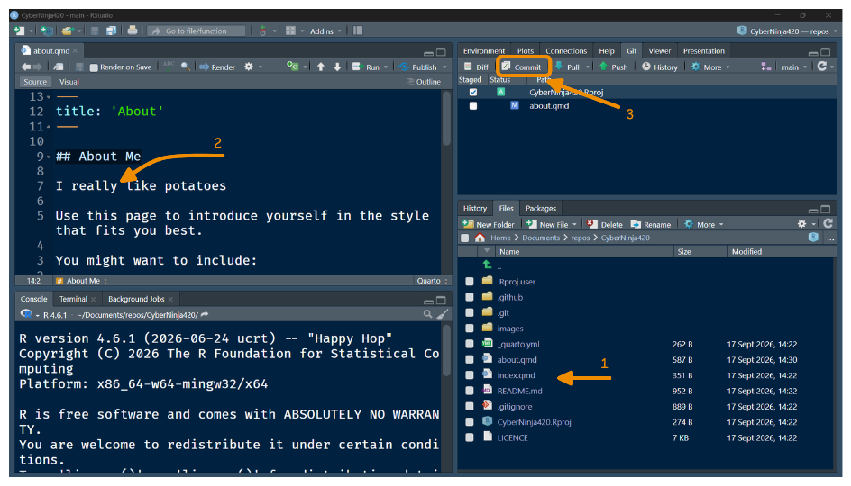

## Commit and push 

:::{.r-stack}
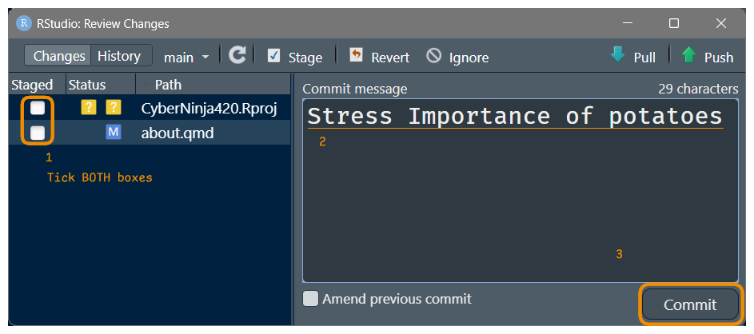{.fragment}

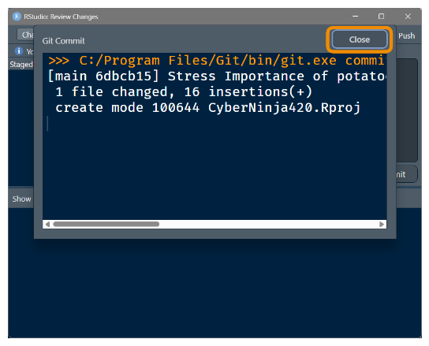{.fragment}

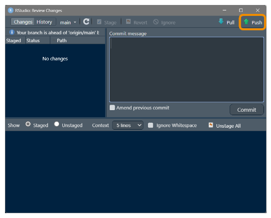{.fragment}
:::

:::{.fragment .highlight-success}
When you click `Push` the "Build Pages" action is triggered 🎊
:::

## Go check it out...

- A live portfolio website at `your-username.github.io/repo-name`
- Automatic rebuilds on every push
- A local development workflow in RStudio

Go back to GitHub, and click the link you configured earlier

:::{.highlight-tip}
Give it a minute - the Action may still be running
:::

